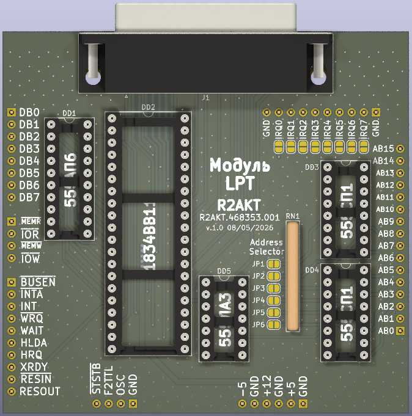

License addendum - https://github.com/R2AKT/LPT/blob/main/Addendum.txt

# LPT

LPT (Centrinics) module. For Mega-80 (Mega-580) DIY 8-bit micro-computer - https://github.com/R2AKT/Mega-80.

Based on 82C11 (1834VV11).

Status: In production. Not tested.

Модуль LPT (Centrinics). Для подключения к процессорной плате CPU_8080 - https://github.com/R2AKT/CPU_8080.

На основе 1834ВВ11 (82C11).

Статус: Изготовливается. Не тестировалась.
